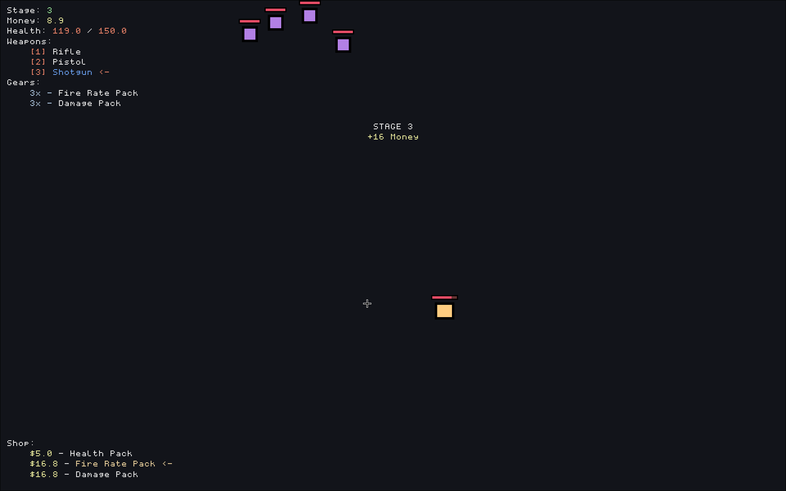

# finite

  + [Download](#download)
  + [Building](#Building)
  + [Controls](#controls)
  + [Screenshots](#Screenshots)

A very simple invaders clone with a few rouge-like elements. The bulk of the game is essentially a shoot-em-up where you kill enemies, get more money, buy items, and repeat... Though, it can serve as a pretty good way to turn off your brain and just burn some time.

## Download

See the [Releases](https://github.com/vakye/finite/releases) page for downloads.

Only Linux with Wayland is supported for now...

## Controls

### Player

  + `w` - Move Up
  + `a` - Move Left
  + `s` - Move Down
  + `d` - Move Right
  + `SpaceBar` - Shoot
  + `1` - Switch to `Rifle` weapon
  + `2` - Switch to `Pistol` weapon
  + `3` - Switch to `Shotgun` weapon

### Shop

  + `q` - Previous Item
  + `e` - Next Item
  + `f` - Buy an Item

## Screenshots

")

